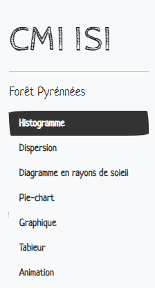
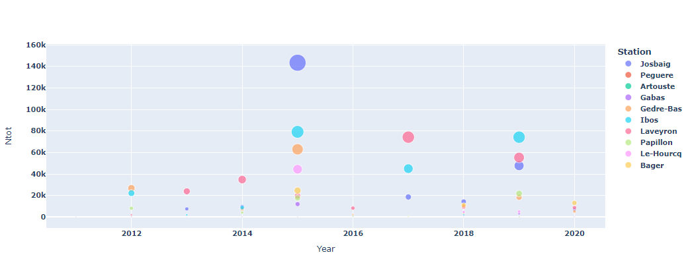

<!DOCTYPE html>
<html lang="fr">
<head>
    <meta charset="UTF-8">
    <meta http-equiv="X-UA-Compatible" content="IE=edge">
    <meta name="viewport" content="width=device-width, initial-scale=1.0">
    <title>Document</title>
</head>
<body>
    # Projet-CMI-ISI-L2

Voici notre projet qui a pour but de déchiffrer les données fournies par des scientifiques travaillant sur certaines forêts des pyrénées.

On propose plusieurs visualisations, comme des sun-burst, pie-chart, ou même des graphes. 

Ceci fait office à la fois de sommaire et de "bouton" pour afficher les visualisations. 

Penchons nous d'abord sur la "Dispersion" qui,  quand on click dessus, nous amène à un graphe nous présentant le nombre de Ntot (nombre de glands) par année et par station.
Ce diagramme est clair car on aperçoie très rapidemment quelle station domine sur les autres selon l'année.

Ensuite, nous avons un diagramme en rayon de soleil et un pie_chart qui se ressemblent mais ne proposent pas tout à fait les mêmes visualisations.
Si on regarde le diagramme en rayon de soleil, on peut voir facilement grâce au découpage du graphe l'ensemble des Ntots d'une station dans une vallée à l'année souhaitée.
Pour accéder à cette valeur, il suffit de glisser la souris sur la partie 

</body>
</html>
